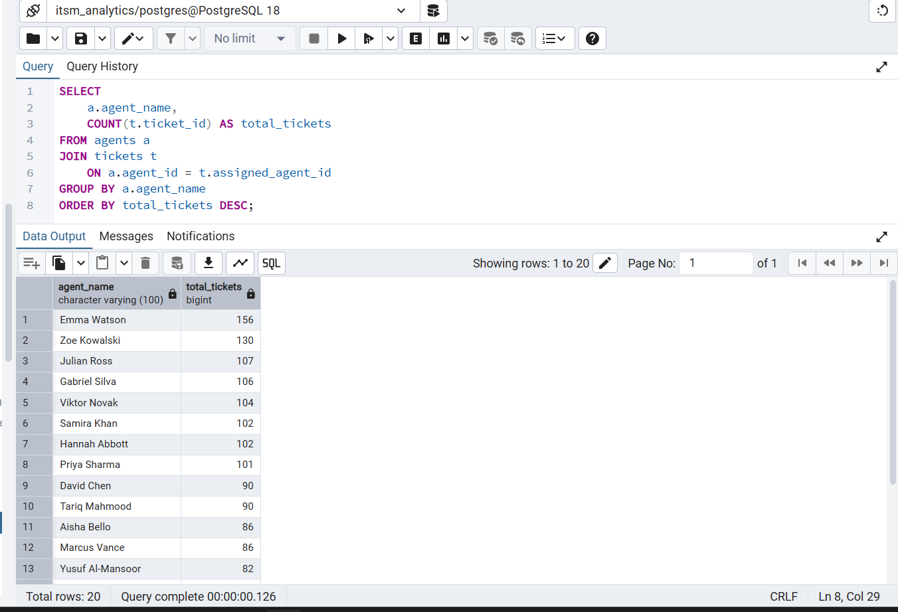
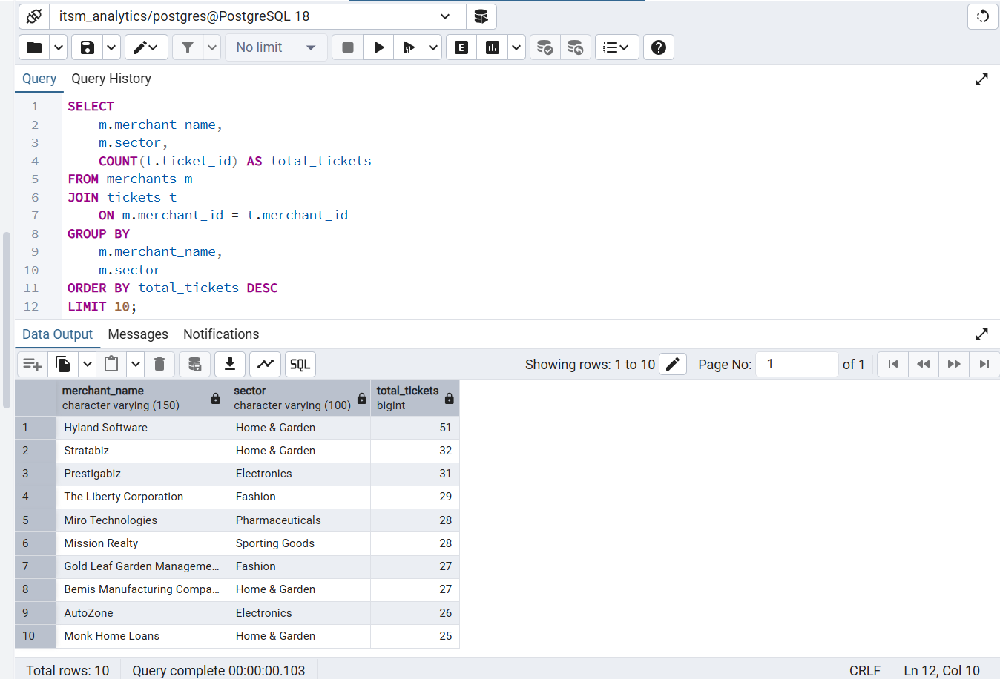

# 🛠️ IT Service Desk Analytics

An IT service desk analytics project that uses **PostgreSQL**, **SQL**, and **Power BI** to analyze support ticket activity, SLA performance, resolution times, agent workload, and service trends.

---

## 📌 Project Overview

The goal of this project is to analyze an IT service desk dataset and turn raw ticket data into useful operational insights.

The project follows an end-to-end analytics workflow:

```
CSV Data → PostgreSQL → SQL Analysis → Power BI → Business Insights
```

The analysis focuses on questions such as:

- How many tickets are being created?
- Which priorities generate the most support requests?
- Which categories have the highest ticket volume?
- How long does it take to resolve tickets?
- How often are resolution SLAs breached?
- How are tickets distributed across support agents?
- Which merchants generate the most support requests?

---

## 🧰 Tools & Technologies

| Tool | Purpose |
|------|---------|
| **PostgreSQL** | Data storage and querying |
| **pgAdmin 4** | Database management and CSV import |
| **SQL** | Data analysis and transformation |
| **Power BI** | Data visualization and dashboard development |
| **Power Query** | Data preparation |
| **DAX** | KPI and dashboard calculations |
| **Git/GitHub** | Project version control |

---

## 🗂️ Dataset

The dataset consists of three CSV files, included in the `data/` folder:

| File | Description |
|------|-------------|
| `tickets.csv` | Support ticket records |
| `agents.csv` | Support agent details |
| `merchants.csv` | Merchant/customer details |

### Tables

**Tickets** (`tickets.csv`)
- Ticket ID
- Merchant ID
- Category
- Sub-category
- Priority
- Created date
- First response time
- Resolution time
- Response SLA status
- Resolution SLA status
- Reopened status
- CSAT score

**Agents** (`agents.csv`)
- Agent ID
- Agent name
- Support tier
- Primary category
- Shift region
- Efficiency multiplier

**Merchants** (`merchants.csv`)
- Merchant ID
- Merchant name
- Sector
- Merchant tier
- Region

---

## 🔍 SQL Analysis

The CSV files were imported into PostgreSQL using pgAdmin 4. The SQL queries are organized into practical questions that become progressively more advanced, and are available in the sql-analysis-queries

### Analysis Covered

- Ticket volume by priority
- Ticket volume by category
- Average resolution time by priority
- Resolution SLA breach analysis
- Tickets handled by each agent
- Average resolution time by category
- Monthly ticket volume
- Top merchants by ticket volume
- Ranking categories within each priority
- Tickets requiring further investigation

### SQL Features Used

- `GROUP BY`
- Aggregate functions
- `JOIN`
- `WHERE`
- `FILTER`
- `DATE_TRUNC`
- CTEs
- Window functions

---

## 💡 Key Business Questions

The analysis is intended to help answer operational questions such as:

- Where is the service desk experiencing the most demand?
- Which ticket priorities take the longest to resolve?
- Which categories contribute most to SLA breaches?
- Are some agents handling significantly more tickets than others?
- Which merchants generate the highest support volume?
- Are there recurring areas that may require process improvements?
## 🔍 SQL Analysis Results

### Tickets Handled by Each Agent


### Top Merchants by Ticket Volume

---
